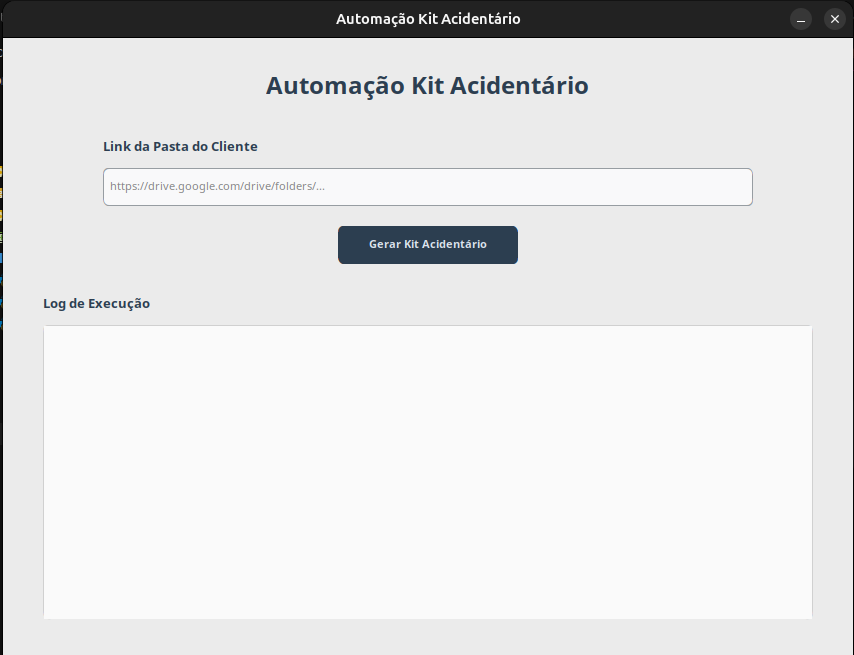

# CASO DE USO: Gerar Kit Acidentário

## UC001 - Gerar Kit Acidentário do Cliente

**Objetivo**
Automatizar o preenchimento do Kit Acidentário extraindo os dados do cliente a partir de um arquivo "contrato" já existente na pasta do cliente no Google Drive. Os dados extraídos são processados por um LLM (ChatGPT), que formula e estrutura as informações do cliente de forma padronizada antes de preencher o documento final.

**Tecnologias Principais**
- Interface gráfica moderna desenvolvida com **CustomTkinter**
- Executável standalone compilado com **PyInstaller** (Windows/Linux)
- Integração com **Google Drive API** e **Google Docs API**
- Processamento inteligente de dados com **OpenAI GPT-4**

**Ator Principal**
Funcionário do escritório (usuário do sistema)

**Pré-condições**

- A pasta do cliente existe no Google Drive
- O arquivo "contrato" existe na pasta do cliente
- O template - existe no Drive

**Pós-condições**

- Cópia do template criada na pasta do cliente
- Campos do Kit Acidentário preenchidos com os dados extraídos do contrato

### Fluxo Principal

1. Receber o link da pasta do cliente
2. Conectar na API do Google
3. Encontrar o template 
4. Fazer uma cópia do template "Kit Acidentário - Atualizado" para a pasta do cliente
5. Procurar o arquivo "contrato" na pasta do cliente
6. Realizar a extração dos dados do arquivo "contrato"
7. Mapear os campos que devem ser atualizados no arquivo "Kit Acidentário - Atualizado"
8. Atualizar os campos mapeados com os valores extraídos do arquivo "contrato"

#### Regras de Negócio

- RN01: O arquivo final deve ser um GDOC (Google Docs nativo)

##### Objetos

- DadosCliente
  - nomeCompleto: string
  - qualificacao: string

- PastaCliente
  - id: string
  - nome: string
  - link: string

- Template
  - id: string
  - nome: string

- KitAcidentario
  - id: string
  - nome: string
  - pastaClienteId: string
  - dadosCliente: DadosCliente
  - campos: list<CampoDocumento>

- CampoDocumento
  - placeholder: string
  - valor: string

- Arquivo
  - id: string
  - nome: string
  - pastaId: string
  - conteudo: bytes

###### Interfaces

- `encontrarTemplate(templateId: string): Template`
- `copiarTemplateParaPasta(templateId: string, pastaDestinoId: string, novoNome: string): KitAcidentario`
- `procurarContrato(pastaId: string): list<Arquivo>`
- `extrairDadosContrato(arquivos: list<Arquivo>): DadosCliente`
- `mapearCampos(kitDocId: string): list<CampoDocumento>`
- `atualizarCampos(kitDocId: string, dadosCliente: DadosCliente): KitAcidentario`
